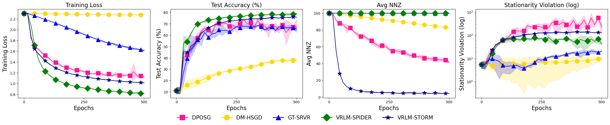
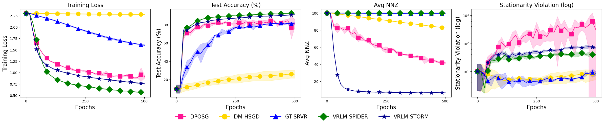
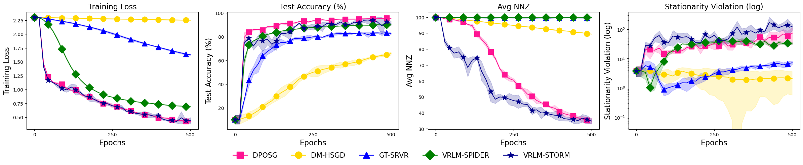
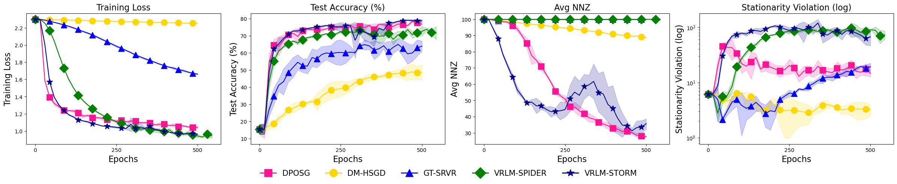
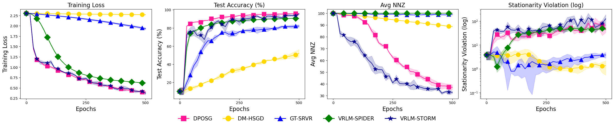
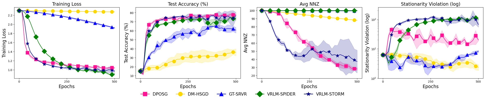

# Additional Numerical Experiments

Per the suggestion of Reviewers PpxE and PYRf, we conducted more experiments to evaluate the proposed algorithms, including heterogeneous data, homogeneous data on more agents, and experiments on different communication graphs.

---

## Heterogeneous Setting and more topologies

We partition the dataset based on labels such that each agent is assigned data from a single class only. With 10 agents and 10 classes, each agent exclusively holds samples from one class, representing an extreme non-i.i.d. scenario. We adopt the same decentralized sparse DRO formulation as before and evaluate on both MNIST and Fashion-MNIST. In addition to using the previous ring-structured communication graph, we also used the 2 by 5 ladder-structured communication topology. Due to limitation of computing resource (CPU-only experiments), we adopt the previously tuned hyperparameters for each compared method, and 3 independent trials were conducted. The results for MNIST data with ring-structured communication graph are shown in Figure 1, results for Fashion-MNIST with ring-structured graph are in Figure 2, results for MNIST data with ladder-structured graph are shown in Figure 3, and results for Fashion-MNIST with ladder-structured graph are in Figure 4.

#### Figure 1: Comparison of proposed methods with three existing methods on MNIST in a heterogeneous setting on ring-structured graph.

#### Figure 2: Comparison of proposed methods with three existing methods on Fashion-MNIST in a heterogeneous setting on ring-structured graph of 10 agents.

#### Figure 3: Comparison of proposed methods with three existing methods on MNIST in a heterogeneous setting on $2\times 5$ ladder-structured graph.

#### Figure 4: Comparison of proposed methods with three existing methods on Fashion-MNIST in a heterogeneous setting on $2\times 5$ ladder-structured graph.

From Figures 1-4, both VRLM-SPIDER and VRLM-STORM consistently outperform other competing methods in terms of training loss and testing accuracy, and VRLM-STORM gives sparsest solutions. As before, all methods struggle to  reduce the stationarity violation across both datasets. 

---

## Homogeneous Setting with More agents

In this setting, we partition the dataset uniformly at random and evenly distribute to 20 agents. Again we test the methods on solving the sparse DRO problem by using the MNIST and FashionMNIST datasets. In addition to the ring-structured graph, we also use a $4\times 5$ grid communication graph. We adopt the same previously tuned hyperparameters for all methods, except that we decreased the primal and dual learning rates from $10^{-4}$ to $4\times 10^{-5}$ for VRLM-SPIDER on both datasets and decreased the primal and dual learning rates from $10^{-2}$ to $4\times 10^{-3}$ for VRLM-STORM on FashionMNIST, because otherwise they will not converge in the new setting.  Three independent trials were conducted. The results for MNIST data with ring-structured communication graph are shown in Figure 5, results for Fashion-MNIST with ring-structured graph are in Figure 6, results for MNIST data with grid-structured graph are shown in Figure 7, and results for Fashion-MNIST with grid-structured graph are in Figure 8.

#### Figure 5: Comparison of proposed methods with three existing methods on MNIST in a homogeneous setting on ring-structured graph of 20 agents.

#### Figure 6: Comparison of proposed methods with three existing methods on Fashion-MNIST in a homogeneous setting on ring-structured graph of 20 agents.

#### Figure 7: Comparison of proposed methods with three existing methods on MNIST in a heterogeneous setting on $2\times 5$ ladder-structured graph.

#### Figure 8: Comparison of proposed methods with three existing methods on Fashion-MNIST in a heterogeneous setting on $2\times 5$ ladder-structured graph.

