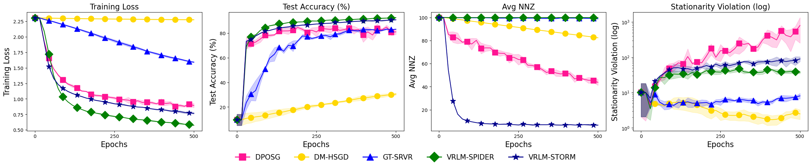
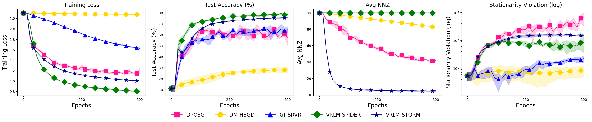

# Additional Numerical Experiments

Per the suggestion of Reviewers PpxE and PYRf, we conducted more experiments to evaluate the proposed algorithms, including heterogeneous data, homogeneous data on more agents, and experiments on different communication graphs.

---

## Heterogeneous Setting and more topologies

We partition the dataset based on labels such that each agent is assigned data from a single class only. With 10 agents and 10 classes, each agent exclusively holds samples from one class, representing an extreme non-i.i.d. scenario. We adopt the same decentralized sparse DRO formulation as before and evaluate on both MNIST and Fashion-MNIST. In addition to using the previous ring-structured communication graph, we also used the 2 by 5 ladder-structured communication topology. Due to limitation of computing resource (CPU-only experiments), we adopt the previously tuned hyperparameters for each compared method, and 3 independent trials were conducted. The results for MNIST data with ring-structured communication graph are shown in Figure 1, results for Fashion-MNIST with ring-structured graph are in Figure 2, results for MNIST data with ladder-structured graph are shown in Figure 3, and results for Fashion-MNIST with ladder-structured graph are in Figure 4.

###### Figure 1: Comparison of proposed methods with three existing methods on MNIST in a heterogeneous setting on ring-structured graph.

###### FashionMNIST

From the figures above, the same trend is observed: both variants of VRLM consistently outperform all competing methods in terms of training loss and testing accuracy. As before, all methods struggle to significantly reduce the stationarity violation across both datasets. However, this limitation does not appear to impact their practical performance, as each method is still able to effectively minimize training loss and achieve competitive testing accuracy.

---

## Homogeneous Setting

For this setting, we run the sparse DRO problem for both the MNIST and FashionMNIST datasets. While the choice of learning rate is the same as before for MNIST, for the FashionMNIST dataset further tuning is applied (details to be specified as needed).

The results are as follows:

---

#### MNIST - Homogeneous

---

#### FashionMNIST - Homogeneous

---
