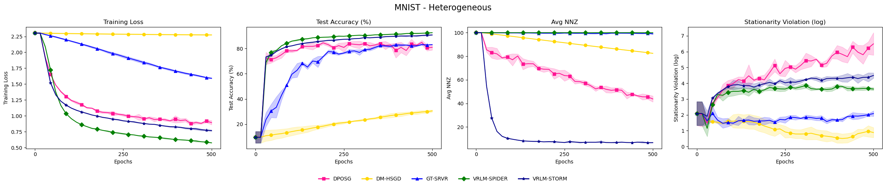
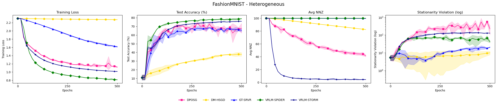
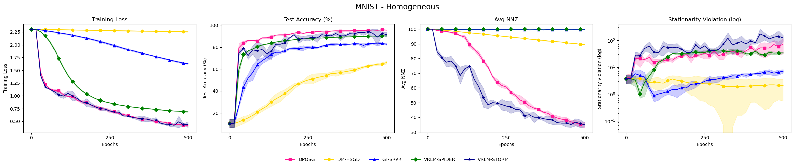
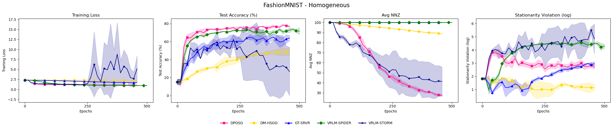

# Additional Numerical Experiments

## Heterogeneous Setting

In response to the reviewer’s request to evaluate performance under data heterogeneity, we extend our experiments to a fully heterogeneous setting. Specifically, we partition the dataset across agents such that each agent is assigned data from a single class only. With 10 agents and 10 classes, each agent exclusively holds samples from one class, representing an extreme non-i.i.d. scenario. We adopt the same decentralized sparse DRO formulation as before and evaluate on both MNIST and Fashion-MNIST. The communication topology is chosen to be a ring network. Due to computational limitations (CPU-only experiments), we do not perform a full hyperparameter grid search in this setting. Instead, we reuse the best-performing hyperparameters identified earlier. While this may not yield individually optimal tuning for each method under heterogeneity, it ensures a fair and consistent comparison while keeping the computational cost manageable.

The results are as follows:

---

### MNIST - Heterogeneous

---

### FashionMNIST - Heterogeneous

---

From the figures above, the same trend is observed: both variants of VRLM consistently outperform all competing methods in terms of training loss and testing accuracy. As before, all methods struggle to significantly reduce the stationarity violation across both datasets. However, this limitation does not appear to impact their practical performance, as each method is still able to effectively minimize training loss and achieve competitive testing accuracy.

---

## Homogeneous Setting

For this setting, we run the sparse DRO problem for both the MNIST and FashionMNIST datasets. While the choice of learning rate is the same as before for MNIST, for the FashionMNIST dataset further tuning is applied (details to be specified as needed).

The results are as follows:

---

### MNIST - Homogeneous

---

### FashionMNIST - Homogeneous

---
